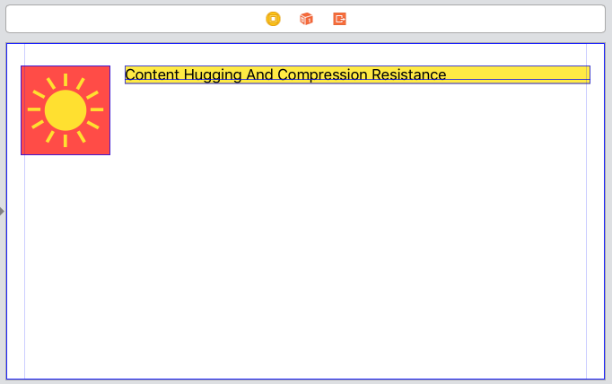
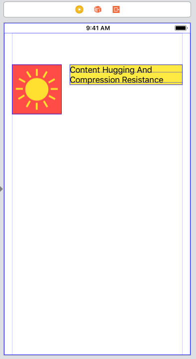

# Content Hugging And Compression Resistance

*All views have Content-Hugging or Compression- Resistance priorities*

*Changing the Content-Hugging or Compression- Resistance priority doesn’t affect views with no intrinsic content size.*

## Don’t Squeeze Me – Compression-Resistance

These tell the layout engine how strongly a view resists be- ing squeezed below its natural size in each dimension. The higher the Compression-Resistance priority, the more a view resists squeezing.

When the layout engine needs to squeeze a view to fit in a space, it chooses the view with the lowest Compression-Resistance priority. If there’s not one view and only one view with the lowest priority the layout is ambiguous.

## Don’t Stretch Me – Content-Hugging

These tell the layout engine how strongly a view resists stretching beyond its natural size in each dimension. The higher the Content-Hugging priority, the more a view resists stretching.

When the layout engine needs to stretch a view to fill a space it chooses the one with the lowest Content-Hugging priority. If there’s not one view and only one view with the lowest priority the layout is ambiguous.

