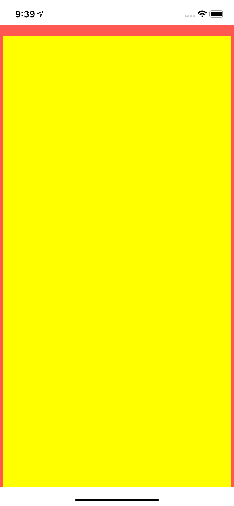
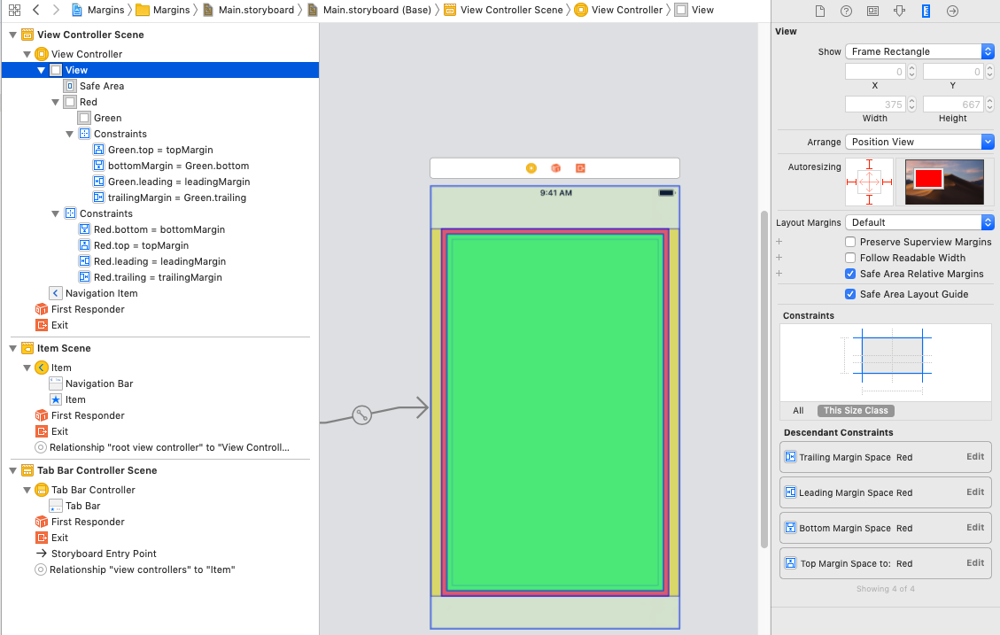
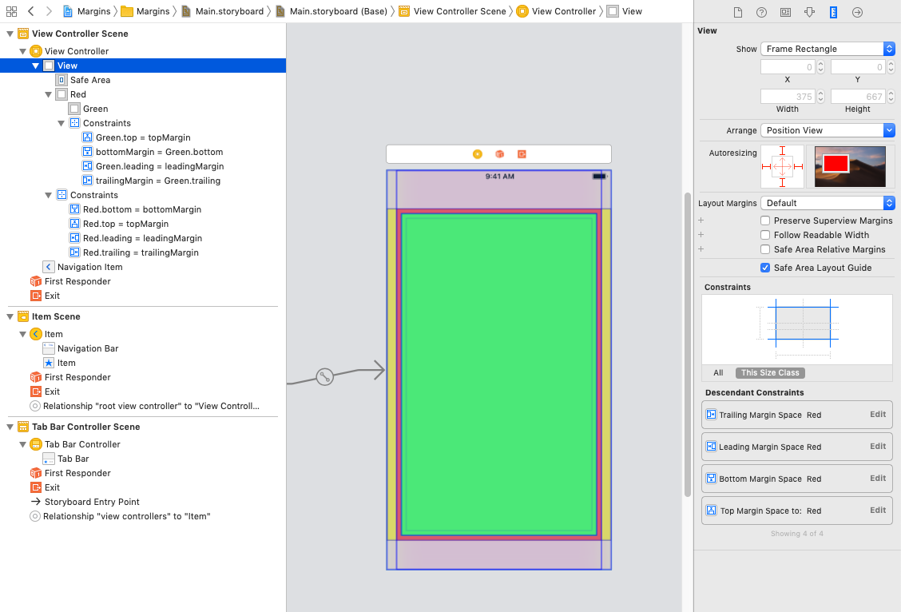

# Margins

Unlike other views, the **system** manages the margins of a view controller’s root view.

Starting in iOS 11 you can change the layout margins of the root view and control whether the system enforces a minimum margin.

## View Respects System Minimum Layout Margins

## Safe Area relative margins ON

## Safe Area relative margins OFF

