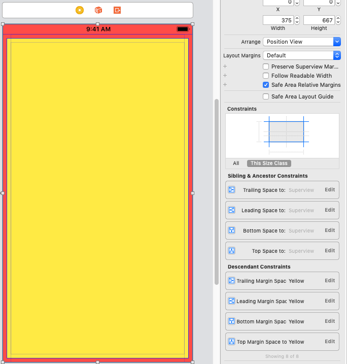
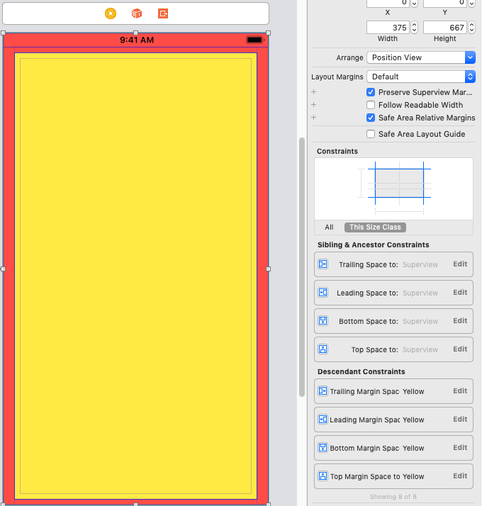

# Margins

Preserving Superview Layout Margins

* the container view is constrained close to the edges of its superview placing it inside the margins of the superview.
* the content view is constrained to the margins of the container view.
* the container view margins are smaller than its superview margins
placing the content view inside the superview margins.

If the content view has constraints to the edges of the container view, the property has no effect

## View Respects System Minimum Layout Margins

Unlike other views, the **system** manages the margins of a view controller’s root view.

Starting in iOS 11 you can change the layout margins of the root view and control whether the system enforces a minimum margin.

## Safe Area relative margins ON

## Safe Area relative margins OFF

