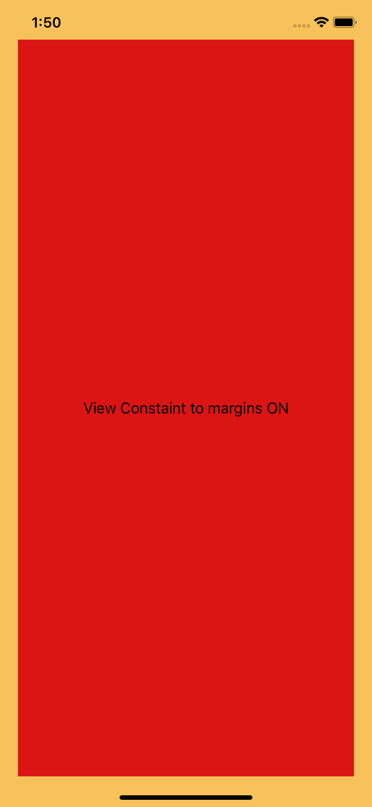

# Margins

The constrain to margins checkbox is a little confusing. When you create a constraint to a view controller’s root view Interface Builder uses the safe area by default and the checkbox has no effect.

