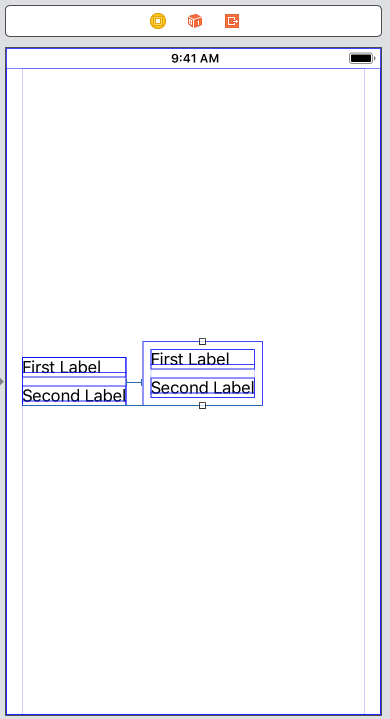
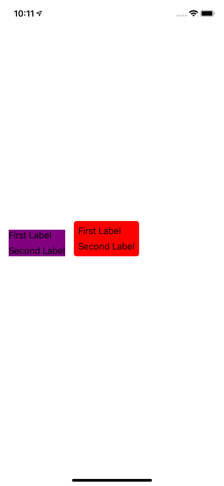

# StackView

A stack view is a non-rendering subclass of `UIView`.

Stack views automatically update the layout of their arranged subviews when you make a change. This includes:

* Adding or removing an arranged subview.
* Changing the isHidden property on any of the arranged subviews.
* Changing the axis, alignment, distribution or spacing proper- ties.

Even better, you can animate any of these changes.

If you use the `fill`, `equal spacing` or `equal centering` distributions you may still need to change the content hugging or compression resistance priorities of the managed views to get a working layout.

## Adding views

When you drag and drop a view onto a stack view in Interface Builder or use the Embed In tool, you’re adding views to both `arrangedSubviews` and `subviews.`

Don’t use `addSubview` when you want `addArrangedSubview`. Adding the view to subviews making it visible as part of the view hierarchy, but the layout is not managed by the stack view.

## Removing views

You can use `removeArrangedSubview(:)` to remove a view from a stack view but be careful. This removes the view from `arrangedSubviews`, and the stack view no longer manages the layout of the view. The view is not removed from `subviews` so is still visible unless you hide it or remove it with `removeFromSuperview()`.

`// remove from arrangedSubviews (view still visible)
stackView.removeArrangedSubview(redButton)`

`// remove from arrangedSubviews and subviews
redButton.removeFromSuperview()`

## Distribution

* `.fill` (the default distribution): Tries to fill the available space keeping the views at their intrinsic content size. If the space is not filled it stretches the view with the lowest content hugging priority. If the views are too big, it shrinks the view with the lowest compression resistance priority.
* `.fillEqually`: Resizes all views to the same size sufficient to fill the space together with any spacing between the views.
* `.fillProportionally`: Resizes views proportionally based on their intrinsic content size maintaining the relative size of each view.
* `.equalSpacing`: If there’s sufficient space, this keeps views at their intrinsic content size and fills the space by evenly padding the spac- ing between views. Otherwise, it shrinks the view with the lowest compression resistance priority to maintain the minimum spacing of the spacing property.
* `.equalCentering`: Pads the spacing between the views to try and create equal distance between the centers of each view. If necessary, the view with the lowest content compression priority shrinks to maintain the minimum spacing of the spacing property.

## Custom Spacing

// iOS 11
`stackView.setCustomSpacing(32.0, after: headerLabel)`
`stackview.setCustomSpacing(UIStackView.spacingUseSystem, after: topLabel)`
`stackview.setCustomSpacing(UIStackView.spacingUseDefault, after: topLabel)`

## isLayoutMarginsRelativeArrangement

## Background color

