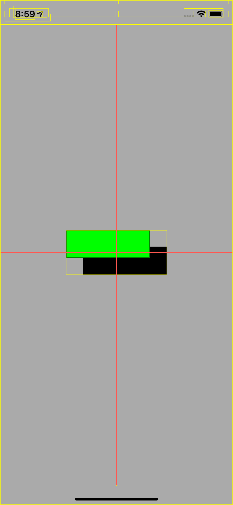
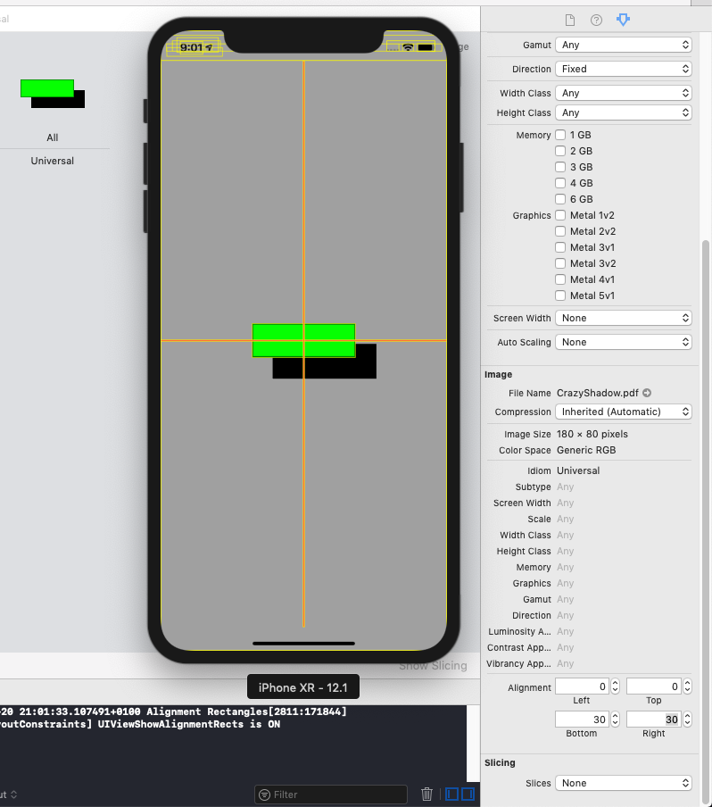

# Alignment Rectangles

## Debugging Alignment Rectangles

Product › Scheme › Edit Scheme...

`-UIViewShowAlignmentRects YES`

## Alignment Rectangles In The Asset Catalog

## Alignment Rectangles In Code

      extension UIImageView {
          convenience init(named name: String, top: CGFloat, left: CGFloat, bottom: CGFloat, right: CGFloat) {
              let insets = UIEdgeInsets(top: top, left: left, bottom: bottom, right: right)
              let originalImage = UIImage(named: name)
              let insetImage = originalImage?.withAlignmentRectInsets(insets)
              self.init(image: insetImage)
          }
      }
