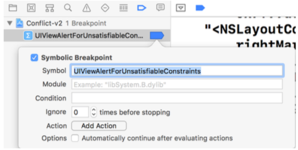

# Debugging

## UIViewAlertForUnsatisfiableConstraints

The debugger breaks when the layout engine detects an unsatisfiable constraint.

## Viewing Constraints That Affect The Layout

The `constraintsAffectingLayout(for axis:)` method returns the constraints impacting the layout of a view or layout guide for the specified axis.

## Checking For Ambiguous Layout

`button.hasAmbiguousLayout` // true or false

## Tracing The View Hierarchy

`expr -l objc -o -- [[[UIApplication sharedApplication] keyWindow] _autolayoutTrace]`

    override func viewDidAppear(_ animated: Bool) {
        super.viewDidAppear(animated)
        print(view.value(forKey: `_autolayoutTrace`)!)
    }

## Exercising Ambiguity

If it’s not already clear why a view has an ambiguous layout you can ask the layout engine to randomly change the frame of a view by calling `exerciseAmbiguityInLayout()` on the view. The layout engine chooses a different frame that still satisfies the constraints.

      extension UIView {
          class func exerciseAmbiguity(_ view: UIView) {
              #if DEBUG
              if view.hasAmbiguousLayout {
                  Timer.scheduledTimer(withTimeInterval: 0.5, repeats: true) { _ in
                      view.exerciseAmbiguityInLayout()
                  }
              } else {
                  for subview in view.subviews {
                      UIView.exerciseAmbiguity(subview)

                  }
              }
              #endif
          }
      }

## Layout Loops

`-UIViewLayoutFeedbackLoopDebuggingThreshold 50`

`po [_UIViewLayoutFeedbackLoopDebugger layoutFeedbackLoopDebugger]`
