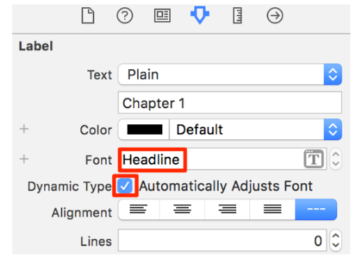
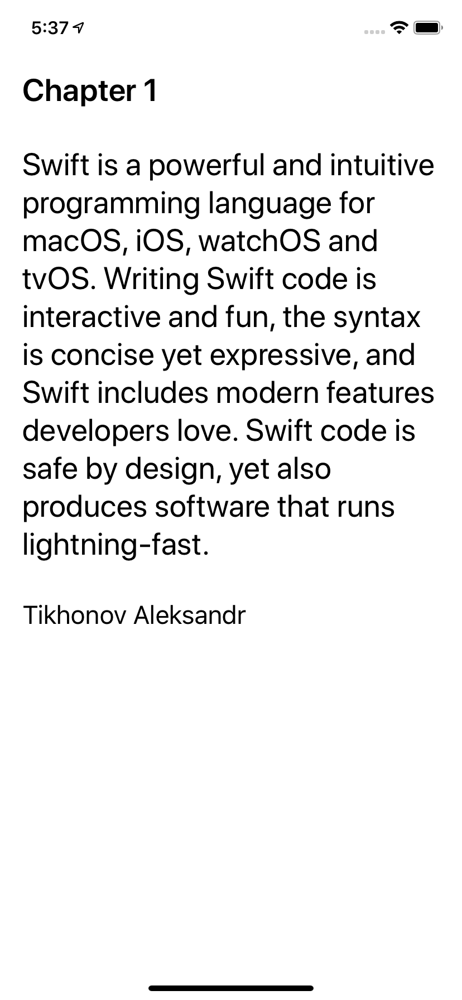
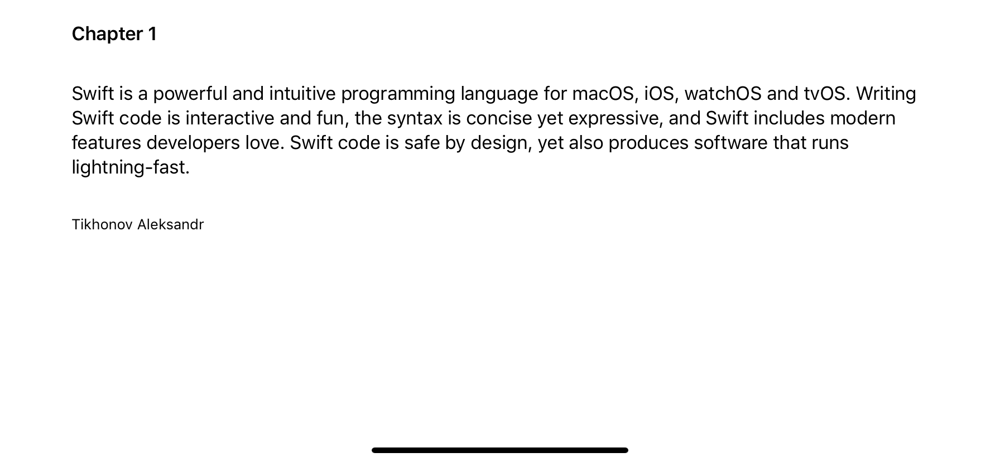
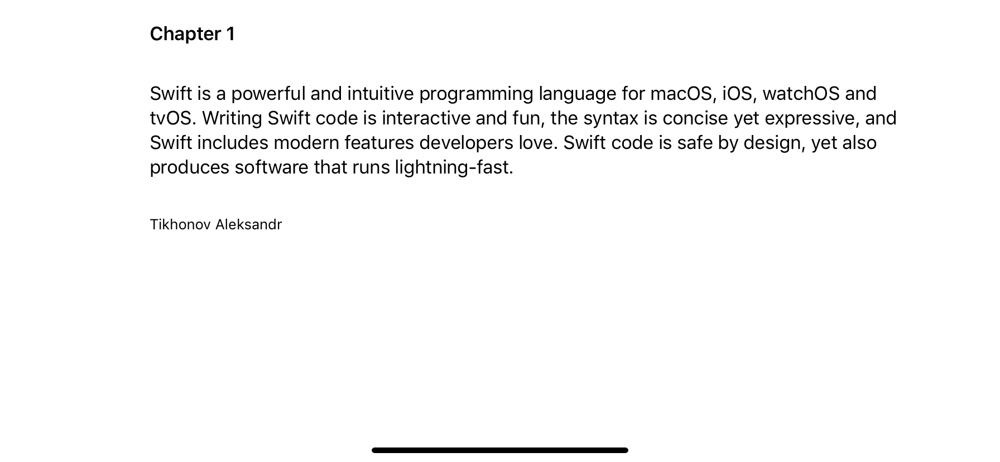

# Dynamic Type

## Interface Builder

See Xcode › Open Developer Tool › Accessibility Inspector

## Text Styles In Code

    label.font = UIFont.preferredFont(forTextStyle: .body)
    label.adjustsFontForContentSizeCategory = true

## Readable Content Guide

The `readableContentGuide` is a property of `UIView`. It’s a layout guide so you use it the same way you use layoutMarginsGuide when creating constraints in code.

A stack view has a readable content guide but you don’t use it directly.

