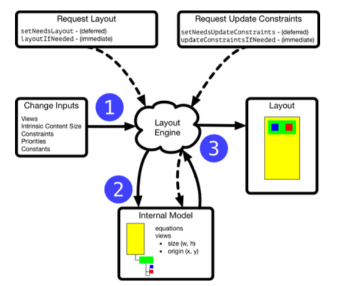
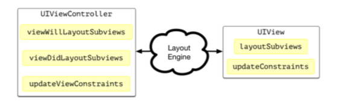
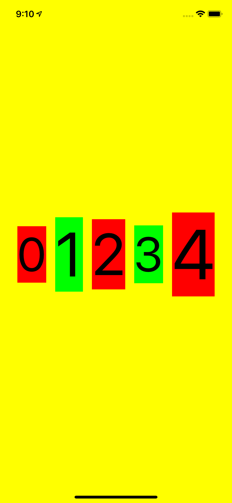
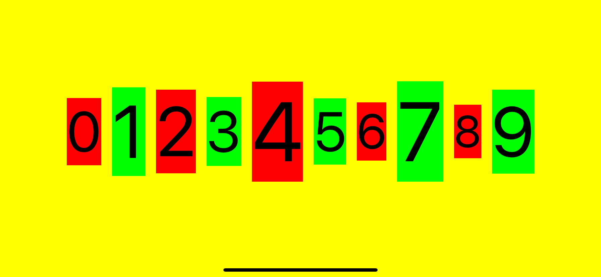

# Layout Engine

1. **Trigger**: You change an input to the layout engine. This can be by adding or removing subviews, changing the intrinsic content size, activating/deactivating constraints or changing the priority or constant value of a constraint.
2. **Update Model**: The layout engine has an internal model of the size and position of each view and the equations that describe the relationships between those views. Changing an input causes the layout engine to update its internal model and solve the equations for new values for the size and position of each view.
At this point, only the internal model has changed. Views that now have a new size or position in the model call setNeedsLayout() on their superview which schedules a deferred layout pass to run some time later on the application run loop.
3. **Deferred Layout Pass**: When the layout pass runs it makes two passes over the view hierarchy. The first pass gives you a last opportunity to update any constraints. The second pass finally calls layoutSubviews() on each view allowing them to update the size and position of their subviews to match the internal model repositioning any views as needed.

There are some methods you can override in both the view controller and view to interact with the layout engine during the two layout passes:
- In the update constraints pass the layout engine calls the view controller’s updateViewConstraints method and for views with pending updates the updateConstraints method.
- In the update layout pass the layout engine calls the view controller’s viewWillLayoutSubviews and viewDidLayoutSubviews methods and the layoutSubviews method of any views needing layout.

## Updating Constraints

The first pass through the view hierarchy is from bottom-up to allow you to change the constraints before the layout engine repositions the views. The layout engine calls updateConstraintsIfNeeded on each view to check it has the latest constraints. For views marked as needing to update their constraints, the layout engine calls their updateConstraints method where you can make the changes.

Call setNeedsUpdateConstraints to request an update constraints pass for a view. If you want the layout engine to update its model immediately call the updateConstraintsIfNeeded method. We’ll see an example of this later in this chapter.

## Repositioning Views
The second pass through the view hierarchy is a top-down pass to reposi- tion the views. It’s only during this pass that the layout engine updates the view frames to match its internal model.

For each view needing layout the default behavior of layoutSubviews() sets the bounds and center of each subview to the new values from the layout engine model. If you have a custom layout that you cannot de- scribe with constraints you can override layoutSubviews(). See Custom Layouts for an example.

Call setNeedsLayout or layoutIfNeeded to request a layout pass for a view. The key difference between these methods is when the layout pass happens to update the view:
- setNeedsLayout: returns immediately without updating the layout. Instead, it marks the layout of the view as changed and schedules a deferred layout pass to run on the application run loop.
- layoutIfNeeded: calls layoutSubviews on the receiver if there are pending changes to force the layout engine to immediately update the size and position of subviews from its internal model.

## Animating Constraints

    // Change constraints
    widthConstraint.constant = 100.0
    let animator = UIViewPropertyAnimator(duration: 1.0, curve: .easeInOut) {
        // Update layout
        self.view.layoutIfNeeded()
    }
    animator.startAnimation()

## StackView Space

    override func layoutSubviews() {

        // After we call super.layoutSubviews() the layout engine has updated the bounds and center of our subviews based on the views and constraints.
        super.layoutSubviews()

        while stackView.bounds.width > bounds.width, let extra = stackView.arrangedSubviews.last {
            extra.removeFromSuperview()
            overflow.insert(extra, at: 0)
            updateConstraintsIfNeeded()
            super.layoutSubviews()
        }

        while let nextItem = overflow.first, stackView.bounds.width + spacing + nextItem.intrinsicContentSize.width <= bounds.width {
            stackView.addArrangedSubview(nextItem)
            overflow.remove(at: 0)
            updateConstraintsIfNeeded()
            super.layoutSubviews()
        }
    }

