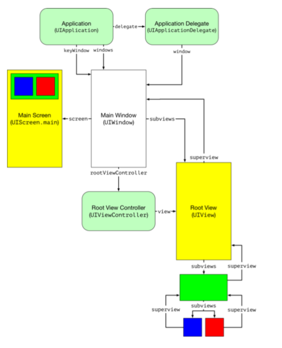
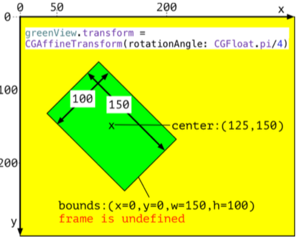

# Layout

- `viewDidLoad`: Called after the view controller has loaded its view but not yet added it to the view hierarchy. Called only once in the life of the view controller.
- `viewWillAppear`: Called when the view controller’s view is about to be added to the view hierarchy. Unlike viewDidLoad this method can be called multiple times in the life of a view controller. There’s a corresponding viewWillDisappear called when the view is about to be removed from the view hierarchy.
- `viewDidAppear`: Called after view controller’s view is added to the view hierarchy and displayed on-screen. Like viewWillAppear this method can be called multiple times and has a corresponding method, viewDidDisappear, called after removing the view.

_It’s a common mistake to assume the size of views are correctly set in the `viewDidLoad` and `viewWillAppear` methods._

The layout engine treats any constraints you create as required constraints by default. The layout engine must satisfy all required constraints, or the layout is invalid.
The layout engine tries to satisfy higher priority constraints first. When it cannot fully satisfy an optional constraint, it does its best to get as close as possible.
Once you have activated a constraint you cannot change its priority from required to optional or vice versa. Doing so causes a runtime crash. You can change the priority of an optional constraint, as long as you keep it optional (< 1000)

Words like **at least** or **at most** suggest a constraint using **inequalities**.
A phrase like **as close as possible** suggests an **optional** constraint.

- Create constraints to the safe area layout guide of the superview for content subviews that you don’t want to be covered by bars or clipped by the rounded corners of an iPhone X style device.
- If you want some extra padding inside the safe area create your constraints to the margins of the superview.
- Use the directional layout margins for right-to-left language support.
- You can change the margins of the root view.

- Activating, changing or deactivating constraints doesn’t directly update the frames of views. Instead, it updates the layout engine model and schedules a layout pass that runs later on the application run loop.
- There are two layout passes over the view hierarchy. The first pass allows you to update the constraints. The second pass updates the view layout by changing the size and position of views to match values from the layout engine model.
- Call setNeedsLayout to manually schedule an update layout pass. Call layoutIfNeeded to force an immediate update to the view frames from the model.
- You rarely need to use updateConstraints or its view controller companion updateViewConstraints. The system calls these methods frequently, so they are not the best choice to do your initial constraint setup. Use them when changing constraints in place is too slow.
- If you’re not using Interface Builder to create your constraints try to create them once when creating your views. If you need to change your constraints at runtime, prefer to activate and deactivate constraints over adding and removing constraints.
- To animate constraint changes call layoutIfNeeded inside a view animation block.
- Override layoutSubviews to create more dynamic layouts.
- The layout engine uses the alignment rectangle not the view frame
when positioning views.

# Layout Essentials

## The View Hierarchy

## Screen (UIScreen)

All iOS devices have a main screen, but you can also connect them to an external screen. You access the main screen and any connected screens using type properties of the UIScreen class.

     let mainScreen = UIScreen.main // UIScreen
     let screens = UIScreen.screens // [UIScreen]

## Window (UIWindow)

The window is an instance of the UIWindow class and is at the root of the view hierarchy that contains our app’s user interface. Most apps have a single window for displaying content on the main screen of the device. You might create a second window to show content on an external screen. By default when you create a window, it displays on the main screen unless you assign a different screen.

## Root View Controller (UIViewController)

The root view controller is usually a custom view controller subclass and supplies the view content for the main window. You typically either load it from your main storyboard or create it manually in the application delegate. Either way, the act of making it the root view controller of the main window adds the view controller’s view to the main window.

## Views (UIView)

The order of the views in the array is crucial as it sets the display order from back to front. So the view at index 0 is at the back, and the last view in the array is at the front.
Add a subview to a parent view by calling the addSubview method of the parent. This appends the subview to the end of the subviews array, so it appears at the front.
What happens if a subview is too big to fit within the bounds of its superview? By default, nothing prevents a subview from extending beyond the bounds of its superview.
Remember that for your views to be visible they must also eventually be part of a view hierarchy that has the main window at its root. You can check for this with the window property of UIView. If this property is nil for a view, then it’s not on-screen.

Apple warns that when a view has a transform, other than the identity transform, the frame is undefined. If you need to get the size, or resize or move a view with a transform use the bounds and center.
