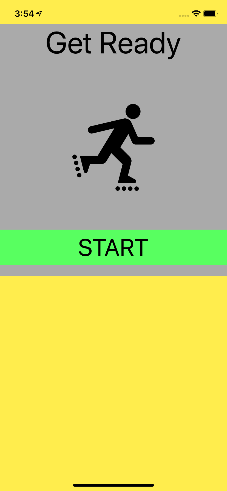
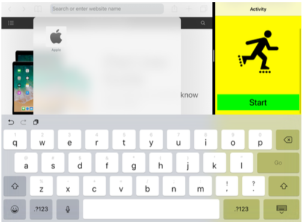

# ScrollView

## Frame And Content Layout Guides

    var frameLayoutGuide: UILayoutGuide { get }
    var contentLayoutGuide: UILayoutGuide { get }

- Pin the frame layout guide to the superview to fix the size and position of the scroll view.
- Pin the content view to the content layout guide.
- If necessary create width or height constraints between the content and frame layout guides to disable horizontal or vertical scrolling.

## Floating Content With Layout Guides

You sometimes want a subview of the scroll view to have a fixed position in the scroll view frame, so it appears to float over the scrollable content. You might do this by constraining the subview to some view external to the scroll view. The frame layout guide makes this much more flexible.

    infoButton.leadingAnchor.constraint(equalTo: scrollView.layoutMarginsGuide.leadingAnchor),
    infoButton.topAnchor.constraint(equalTo: scrollView.layoutMarginsGuide.topAnchor)

## Managing The Keyboard

